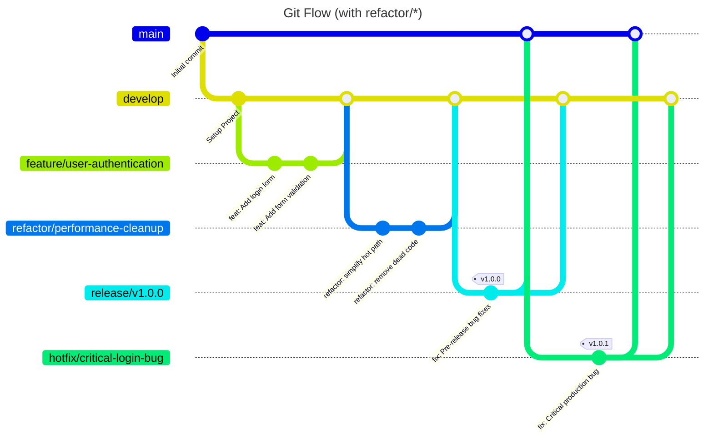

# **Development Workflow & Architecture Guide**

This document outlines the standardized development workflow, repository architecture, and branching strategy for the backend of the AsyncFlow project. Adhering to these guidelines ensures consistency, maintainability, and a scalable development process.


## 1. Repository Layout

### 1.1 Backend Service (`AsyncFlow-backend`)

The repository hosts the entire FastAPI backend for AsyncFlow.
Its job is to expose the REST API, run the discrete-event simulation, talk to the database, and provide metrics.

```
AsyncFlow-backend/
├── example/                         # examples of working simulations
│   ├── data
├── scripts/                         # helper bash scripts (lint, dev-startup, …)
│   └── quality-check.sh
├── docs/                            # project vision & low-level docs
│   └── AsyncFlow-documentation/
├── tests/                           # unit & integration tests
│   ├── unit/
│   └── integration/
├── src/                             # application code lives here
│   └── app/
│       ├── config/                  # Pydantic Settings + constants
│       ├── metrics/                 # logic to compute/aggregate simulation KPIs
│       ├── resources/               # SimPy resource registry (CPU/RAM containers, etc.)
│       ├── runtime/                 # simulation core
│       │   ├── rqs_state.py         # RequestState & Hop
│       │   ├── simulation_runner.py # logic to initialize the whole simulation
│       │   └── actors/              # SimPy “actors”: Edge, Server, Client, RqsGenerator
│       ├── pybuilder/               # Pythonic way to build the simulation payload
│       ├── samplers/                # stochastic samplers (Gaussian-Poisson, etc.)
│       ├── schemas/                 # Pydantic input/output models
├── poetry.lock
├── pyproject.toml
└── README.md
```

> Note: If your package name under `src/` is `asyncflow/` (instead of `app/`), the structure is identical—only the package folder name changes.

### What each top-level directory in `src/app` does

| Directory        | Purpose                                                                                                                                                                 |
| ---------------- | ----------------------------------------------------------------------------------------------------------------------------------------------------------------------- |
| **`config/`**    | Centralised configuration layer. Contains Pydantic `BaseSettings` classes for reading environment variables and constants/enums used across the simulation engine.      |
| **`metrics/`**   | Post-processing and analytics. Aggregates raw simulation traces into KPIs such as latency percentiles, throughput, resource utilisation, and other performance metrics. |
| **`resources/`** | Runtime resource registry for simulated hardware components (e.g., SimPy `Container`s for CPU and RAM). Decouples resource management from actor behaviour.             |
| **`runtime/`**   | Core simulation engine. Orchestrates SimPy execution, maintains request state, and wires together simulation components. Includes:                                      |
|                  | - **`rqs_state.py`** — Defines `RequestState` and `Hop` for tracking request lifecycle.                                                                                 |
|                  | - **`simulation_runner.py`** — Entry point for initialising and running simulations.                                                                                    |
|                  | - **`actors/`** — SimPy actor classes representing system components (`RqsGenerator`, `Client`, `Server`, `Edge`) and their behaviour.                                  |
| **`pybuilder/`** | Pythonic builder to programmatically construct validated simulation payloads (alternative to YAML).                                                                     |
| **`samplers/`**  | Random-variable samplers for stochastic simulation. Supports Poisson, Normal, and mixed distributions for modelling inter-arrival times and service steps.              |
| **`schemas/`**   | Pydantic models for input/output validation and serialisation. Includes scenario definitions, topology graphs, simulation settings, and results payloads.               |

---

### Other Top-Level Directories

| Directory      | Purpose                                                                                                                                           |
| -------------- | ------------------------------------------------------------------------------------------------------------------------------------------------- |
| **`example/`** | Ready-to-run simulation scenarios and example configurations. Includes `data/` with YAML definitions and scripts to demonstrate engine usage.     |
| **`scripts/`** | Utility shell scripts for development workflow, linting, formatting, and local startup (`quality-check.sh`, etc.).                                |
| **`docs/`**    | Project documentation. Contains both high-level vision documents and low-level technical references (`AsyncFlow-documentation/`).                 |
| **`tests/`**   | Automated test suite, split into **unit** and **integration** tests to verify correctness of both individual components and end-to-end scenarios. |

---

## 2. Branching Strategy: Git Flow

To manage code development and releases in a structured manner, we use the **Git Flow** branching model—with an additional **refactor** branch type for non-feature refactoring work.

### Git Flow Workflow Diagram



---

### Git Flow Explained

This workflow is built upon two long-lived branches and several temporary, supporting branches.

#### Main Branches

1. **`main`**
   **Purpose**: Production-ready, stable code. Every commit on `main` represents an official release.
   **Rules**: Never commit directly to `main`. It only receives merges from `release/*` and `hotfix/*`. Each merge should be **tagged** (e.g., `v1.0.0`).

1. **`develop`**
   **Purpose**: The main integration branch for ongoing development. It contains all completed and tested changes planned for the next release.
   **Rules**: Base for `feature/*` and `refactor/*` branches. Reflects the most up-to-date development state.

#### Supporting Branches

3. **`feature/*`** (e.g., `feature/user-authentication`)
   **Purpose**: Develop a new, specific feature in isolation.
   **Lifecycle**:

   1. Branched off **`develop`**.
   1. When complete, open a **Pull Request (PR)** back into **`develop`**.
   3. Delete the branch after merge.

3. **`refactor/*`** (e.g., `refactor/performance-cleanup`) **← new**
   **Purpose**: Perform **non-functional code changes** (no new features), such as internal restructurings, performance optimisations, reducing technical debt, renaming, file moves, or dependency hygiene.
   **Rules**:

   * Must **not** introduce user-visible features or breaking API/DB changes.
   * Prefer commit prefix `refactor:`; avoid `feat:`.
   * Keep changes scoped and well-described to simplify review.
     **Lifecycle**:

   1. Branched off **`develop`**.
   1. Open a **PR** back into **`develop`** (same review gates as features).
   3. Delete the branch after merge.

5. **`release/*`** (e.g., `release/v1.1.0`)
   **Purpose**: Prepare a production release—final bug fixes, docs, and last-minute tests. The feature set is frozen here.
   **Lifecycle**:

   1. Branched off **`develop`** when feature-complete.
   1. Merge into **`main`** (tag version) and back into **`develop`**.
   3. Delete after merges.

6. **`hotfix/*`** (e.g., `hotfix/critical-login-bug`)
   **Purpose**: Quickly patch a critical bug in production.
   **Lifecycle**:

   1. Branched off **`main`** (from a specific tag).
   1. Merge into **`main`** (tag a patch version, e.g., `v1.0.1`) **and** into **`develop`**.
   3. Delete after merges.

**When to choose which branch?**

* **New behavior / endpoints / DB migrations** → `feature/*`
* **Internal code improvements only** → `refactor/*`
* **Release prep** → `release/*`
* **Production emergency** → `hotfix/*`

---

## 3. Continuous Integration / Continuous Delivery (CI/CD) Pipeline

A robust CI/CD pipeline guarantees that every change is automatically validated, packaged, and—when appropriate—promoted to the next environment. Our pipeline is built with **GitHub Actions** and mirrors the branching model.

We start with the CI part related to pushes and PRs in the backend service.

### 3.1 CI for project-backend on `develop`

#### 3.1.1 Goals

* **Fast feedback** – linting, type-checking, and unit tests finish quickly for every Pull Request.
* **Confidence in integration** – migrations, integration tests, and Docker smoke-tests run on every push to `develop`.
* **Deployment safety** – only artifacts from a green pipeline can be released/deployed.
* **Parity with production** – the same multi-stage Dockerfile is built and probed in CI.

#### 3.1.1 Pipeline Layers

* **Quick Suite (PR to `develop`)**
  *Runs in seconds; no external services or containers.*

  * Black, isort, Flake8 (or Ruff if adopted)
  * mypy static type-checking
  * Unit tests only (`pytest -m "not integration"`)

* **Full Suite (push to `develop`)**
  *Runs in a few minutes; includes real services and Docker.*

  * Full test suite, including `@pytest.mark.integration` tests
  * Database migrations (PostgreSQL) against a disposable instance
  * Redis available for tests if required
  * Build multi-stage Docker image and run a quick smoke test

### 3.1 CI for `feature/*` and `refactor/*`

* **On PR to `develop`**: run the **Quick Suite** (lint, type-checking, unit tests).
* **Optional (recommended for large changes)**: allow a manual or scheduled **Full Suite** run for the branch to catch integration issues early.
* **On merge to `develop`**: the **Full Suite** runs (as described above).

> `refactor/*` branches should maintain **zero behavior change**. If a refactor has the potential to alter behavior (e.g., performance-sensitive code), add targeted tests and consider a manual Full Suite run before merge.

### 3.3 CI for `release/*`

* Always run the **Full Suite**.
* Build and publish versioned artifacts/images to the registry with the release tag.
* Prepare release notes and changelog generation.

### 3.3 CI for `hotfix/*`

* Run the **Full Suite** against the hotfix branch.
* Tag the patch release on merge to `main` and propagate the merge back to `develop`.

---

## 4. Quality Gates & Conventions

* **Static Analysis**: mypy (no new type errors).
* **Style**: Black/Flake8/isort or Ruff; no lint violations.
* **Tests**:

  * Unit tests for new logic or refactor touch points.
  * Integration tests for cross-layer behavior.
* **Commits**: Conventional commits (`feat:`, `fix:`, `refactor:`, `docs:`, `test:`, `chore:` …).
* **Code Review**: PRs must be reviewed and approved; refactors must include rationale in the PR description (what changed, why safe).
* **Documentation**: Update `README`, `docs/`, and API docs when applicable.

---


By following this workflow—now with the **refactor** branch type—you keep feature development cleanly separated from codebase improvements, reduce merge friction, and maintain a predictable, high-quality delivery pipeline.
