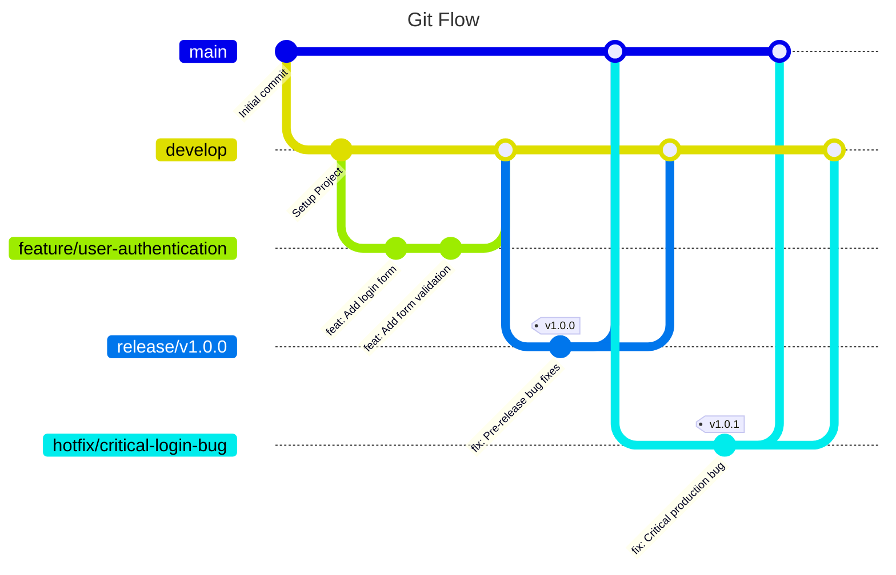

# **Development Workflow & Architecture Guide**

This document outlines the standardized development workflow, repository architecture, and branching strategy for the backend of the FastSim project. Adhering to these guidelines ensures consistency, maintainability, and a scalable development process.

## 1. Technology Stack

The project is built upon the following core technologies:

-   **Backend**: FastAPI
-   **Backend Package Manager**: Poetry
-   **Frontend**: React + JavaScript
-   **Database**: PostgreSQL
-   **Caching**: Redis
-   **Containerization**: Docker

### 2.1  Backend Service (`FastSim-backend`)

The repository hosts the entire FastAPI backend for FastSim.
Its job is to expose the REST API, run the discrete-event simulation, talk to the database, and provide metrics.

```
fastsim-backend/
├── example/                         # examples of working simulations
│   ├── data
├── scripts/                         # helper bash scripts (lint, dev-startup, …)
│   └── quality-check.sh
├── docs/                            # project vision & low-level docs
│   └── fastsim-documentation/
├── tests/                           # unit & integration tests
│   ├── unit/
│   └── integration/
├── src/                             # application code lives here
│   └── app/
│       ├── config/                  # Pydantic Settings + constants
│       ├── metrics/                 # logic to compute/aggregate simulation KPIs
│       ├── resources/               # SimPy resource registry (CPU/RAM containers, etc.)
│       ├── runtime/                 # simulation core
│       │   ├── rqs_state.py         # RequestState & Hop
│       │   ├── simulation_runner.py # logic to initialize the whole simulation
        |   └── actors/              # SimPy “actors”: Edge, Server, Client, RqsGenerator
        ├── pybuilder/               # Pythonic way to build the simulation payload
│       ├── samplers/                # stochastic samplers (Gaussian-Poisson, etc.)
│       ├── schemas/                 # Pydantic input/output models
├── poetry.lock
├── pyproject.toml
└── README.md
```
### **What each top-level directory in `src/app` does**

| Directory        | Purpose                                                                                                                                                                 |
| ---------------- | ----------------------------------------------------------------------------------------------------------------------------------------------------------------------- |
| **`config/`**    | Centralised configuration layer. Contains Pydantic `BaseSettings` classes for reading environment variables and constants/enums used across the simulation engine.      |
| **`metrics/`**   | Post-processing and analytics. Aggregates raw simulation traces into KPIs such as latency percentiles, throughput, resource utilisation, and other performance metrics. |
| **`resources/`** | Runtime resource registry for simulated hardware components (e.g., SimPy `Container`s for CPU and RAM). Decouples resource management from actor behaviour.             |
| **`runtime/`**   | Core simulation engine. Orchestrates SimPy execution, maintains request state, and wires together simulation components. Includes:                                      |
|                  | - **`rqs_state.py`** — Defines `RequestState` and `Hop` for tracking request lifecycle.                                                                                 |
|                  | - **`simulation_runner.py`** — Entry point for initialising and running simulations.                                                                                    |
|                  | - **`actors/`** — SimPy actor classes representing system components (`RqsGenerator`, `Client`, `Server`, `Edge`) and their behaviour.                                  |
| **`samplers/`**  | Random-variable samplers for stochastic simulation. Supports Poisson, Normal, and mixed distributions for modelling inter-arrival times and service steps.              |
| **`schemas/`**   | Pydantic models for input/output validation and serialisation. Includes scenario definitions, topology graphs, simulation settings, and results payloads.               |

---

### **Other Top-Level Directories**

| Directory      | Purpose                                                                                                                                           |
| -------------- | ------------------------------------------------------------------------------------------------------------------------------------------------- |
| **`example/`** | Ready-to-run simulation scenarios and example configurations. Includes `data/` with YAML definitions and scripts to demonstrate engine usage.     |
| **`scripts/`** | Utility shell scripts for development workflow, linting, formatting, and local startup (`quality-check.sh`, etc.).                                |
| **`docs/`**    | Project documentation. Contains both high-level vision documents and low-level technical references (`fastsim-documentation/`).                   |
| **`tests/`**   | Automated test suite, split into **unit** and **integration** tests to verify correctness of both individual components and end-to-end scenarios. |

---

## 3. Branching Strategy: Git Flow

To manage code development and releases in a structured manner, we use the **Git Flow** branching model.

### Git Flow Workflow Diagram



---

### Git Flow Explained

This workflow is built upon two long-lived branches and several temporary, supporting branches.

#### Main Branches

1.  **`main`**
    *   **Purpose**: This branch contains **production-ready, stable code**. Every commit on `main` represents a new, official release.
    *   **Rules**: You should **never** commit directly to `main`. It only receives merges from `release/*` and `hotfix/*` branches. Each merge should be tagged with a version number (e.g., `v1.0.0`).

2.  **`develop`**
    *   **Purpose**: This is the main **integration branch** for ongoing development. It contains all completed and tested features that are planned for the next release.
    *   **Rules**: It's the base for creating new `feature/*` branches. It reflects the most up-to-date state of development.

#### Supporting Branches

3.  **`feature/*`** (e.g., `feature/user-authentication`)
    *   **Purpose**: To develop a new, specific feature in isolation.
    *   **Lifecycle**:
        1.  Branched off of **`develop`**.
        2.  Once development is complete, a **Pull Request (PR)** is opened to merge the changes back into **`develop`**.
        3.  After the merge, the `feature/*` branch can be deleted.

4.  **`release/*`** (e.g., `release/v1.2.0`)
    *   **Purpose**: To prepare for a new production release. This branch is used for final bug fixes, documentation updates, and last-minute testing. It freezes the feature set for the release.
    *   **Lifecycle**:
        1.  Branched off of **`develop`** when it's decided that the next version is feature-complete.
        2.  When ready, it is merged into **`main`** (and tagged) and also back into **`develop`** to ensure any fixes made during the release phase are not lost.
        3.  After merging, the `release/*` branch can be deleted.

5.  **`hotfix/*`** (e.g., `hotfix/critical-login-bug`)
    *   **Purpose**: To quickly patch a critical bug discovered in the production version (`main`).
    *   **Lifecycle**:
        1.  Branched off of **`main`** (from the specific version tag).
        2.  Once the fix is ready, it is merged into **`main`** (and a new patch version tag is created, e.g., `v1.0.1`).
        3.  It is also merged into **`develop`** to ensure the fix is included in future releases.
        4.  After merging, the `hotfix/*` branch can be deleted.

## 4. Continuous Integration / Continuous Delivery (CI/CD) Pipeline

A robust CI/CD pipeline guarantees that every change pushed to the repository is automatically validated, packaged, and—when appropriate—promoted to the next environment.
Our pipeline is built with **GitHub Actions** and follows a layered approach that mirrors the Git Flow branching model.

We will start to describe the CI part related to push and PR in the develop branch of the backend service.

### 4.1  CI for project-backend on `develop`

#### 4.1.1  Goals

* **Fast feedback** – linting, type-checking, and unit tests finish in under a minute for every Pull Request.
* **Confidence in integration** – migrations, integration tests, and Docker smoke-tests run on every push to `develop`.
* **Deployment safety** – only artifacts produced from a green pipeline can be released or deployed.
* **Parity with production** – the same multi-stage Dockerfile is built and probed in CI, preventing “works-on-my-machine” surprises.

### 4.1.2  Pipeline Layers

* **Quick Suite (PR to `develop`)**
  *Runs in seconds; no external services or containers.*

  * Black, isort, Flake8
  * mypy static type-checking
  * Unit tests only (`pytest -m "not integration"`)

* **Full Suite (push to `develop`)**
  *Runs in a few minutes; includes real services and Docker.*
  
  * Full test suite, including `@pytest.mark.integration` tests
  


