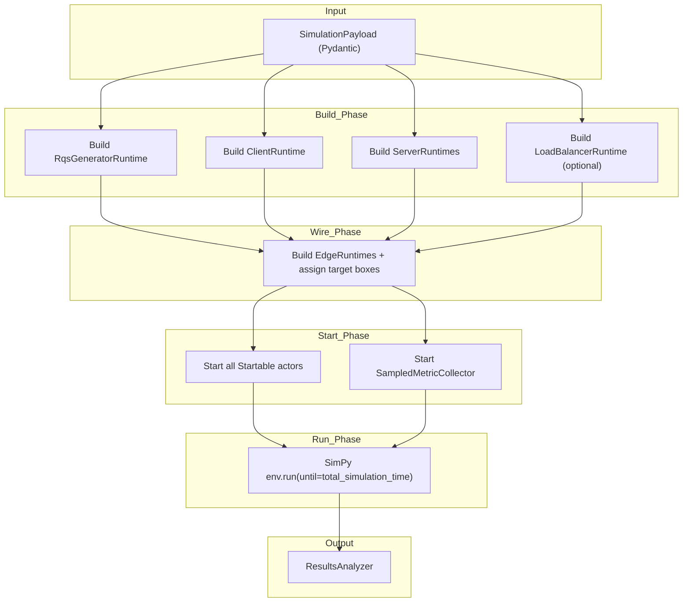
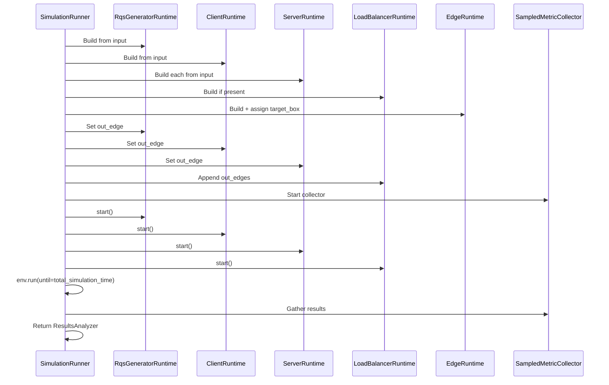

# **Simulation Runner — Technical Documentation**

## **Overview**

The `SimulationRunner` is the **orchestrator** of the FastSim engine.
Its main responsibility is to:

1. **Build** simulation actors from a structured input (`SimulationPayload`).
2. **Wire** actors together via `EdgeRuntime` connections.
3. **Start** all simulation processes in a SimPy environment.
4. **Run** the simulation clock for the configured duration.
5. **Collect and return** performance metrics through a `ResultsAnalyzer` instance.

This design separates **topology definition** (data models) from **execution logic** (runtime actors), ensuring clarity, testability, and future extensibility.

---

## **High-Level Flow**



---

## **Component Responsibilities**

### **SimulationRunner**

* **Inputs:**

  * `env`: a `simpy.Environment` controlling discrete-event simulation time.
  * `simulation_input`: a `SimulationPayload` describing topology, request generation parameters, and simulation settings.

* **Responsibilities:**

  * Build **all runtime actors** (`RqsGeneratorRuntime`, `ClientRuntime`, `ServerRuntime`, `LoadBalancerRuntime`).
  * Instantiate **EdgeRuntime** objects to connect actors.
  * Start processes and the metric collector.
  * Advance the simulation clock.
  * Package results into a `ResultsAnalyzer`.

---

### **Actors**

All runtime actors implement the `Startable` protocol (i.e., they expose a `.start()` method returning a `simpy.Process`).

| Actor                   | Responsibility                                                                               |
| ----------------------- | -------------------------------------------------------------------------------------------- |
| **RqsGeneratorRuntime** | Produces incoming requests according to stochastic models (Poisson, Gaussian-Poisson, etc.). |
| **ClientRuntime**       | Consumes responses, tracks completion, and stores latency samples.                           |
| **ServerRuntime**       | Processes incoming requests, interacts with CPU/RAM containers, measures processing times.   |
| **LoadBalancerRuntime** | Distributes incoming requests across available servers according to configured policy.       |
| **EdgeRuntime**         | Models the connection between two nodes (latency, bandwidth, loss).                          |

---

### **ResourcesRuntime**

* Registry mapping server IDs to their SimPy `Container` resources (CPU, RAM).
* Keeps resource allocation/consumption logic decoupled from server logic.

---

### **Metrics**

* **SampledMetricCollector**: Periodically snapshots runtime metrics (queue sizes, RAM usage, connection counts).
* **ResultsAnalyzer**: Consumes raw metrics and computes aggregated KPIs (latency distribution, throughput series, etc.).

---

## **Execution Timeline**



---

## **Detailed Build & Wire Steps**

### 1️⃣ **Build Phase**

* **`_build_rqs_generator()`**: Creates a single `RqsGeneratorRuntime` for now; architecture allows for multiple (future CDN scenarios).
* **`_build_client()`**: Instantiates the single client node; stored in a dict for future multi-client extensions.
* **`_build_servers()`**: Creates one `ServerRuntime` per configured server. Pulls CPU/RAM resources from `ResourcesRuntime`.
* **`_build_load_balancer()`**: Optional; created only if present in the topology.

---

### 2️⃣ **Wire Phase**

* Merges all runtime actor dictionaries into a `all_nodes` map.
* For each `Edge` in the topology:

  * Looks up **target** object and assigns the correct inbox (`simpy.Store`).
  * Creates an `EdgeRuntime` and assigns it as `out_edge` (or appends to `out_edges` for LBs).

---

### 3️⃣ **Start Phase**

* Uses `itertools.chain` to lazily iterate over all runtime actors in the correct deterministic order.
* Casts to `Iterable[Startable]` to make Mypy type-checking explicit.
* Starts `SampledMetricCollector` to record periodic metrics.

---

### 4️⃣ **Run Phase**

* Advances SimPy’s event loop until `total_simulation_time` from the simulation settings.
* Returns a `ResultsAnalyzer` for downstream reporting and plotting.

---

## **Extensibility Hooks**

* **Multiple Generators / Clients**: Dictionaries keyed by node ID already prepared.
* **CDN or Multi-tier Architectures**: Easily extendable via new actor types + wiring rules.
* **Different LB Policies**: Swap `LoadBalancerRuntime` strategy without touching the runner.
* **Metric Expansion**: `SampledMetricCollector` can be extended to capture additional KPIs.

---

## **Architecture Diagram**

```
             ┌───────────────────────┐
             │ SimulationPayload      │
             │ (input topology + cfg) │
             └─────────┬─────────────┘
                       │
                       ▼
            ┌───────────────────────┐
            │ SimulationRunner       │
            └─────────┬─────────────┘
                      │ build actors
                      ▼
   ┌─────────────────────────────────────────────────┐
   │ Runtime Actors (Startable)                       │
   │ ┌──────────────────┐  ┌──────────────────────┐ │
   │ │ RqsGenerator      │→│ ClientRuntime         │ │
   │ └──────────────────┘  └──────────────────────┘ │
   │        ↓ edges                ↑ edges           │
   │ ┌──────────────────┐  ┌──────────────────────┐ │
   │ │ ServerRuntime(s) │←→│ LoadBalancerRuntime  │ │
   │ └──────────────────┘  └──────────────────────┘ │
   └─────────────────────────────────────────────────┘
                      │
                      ▼
          ┌────────────────────────────┐
          │ SampledMetricCollector      │
          └──────────────┬─────────────┘
                         ▼
               ┌────────────────┐
               │ ResultsAnalyzer │
               └────────────────┘
```

---

## Architectural rationale

✅ **Separation of concerns** — Topology definition, resource allocation, runtime behaviour, and metric processing are decoupled.

✅ **Extensible** — Adding new node types or connection logic requires minimal changes.

✅ **Testable** — Each phase can be tested in isolation (unit + integration).

✅ **Deterministic order** — Startup sequence guarantees reproducibility.

✅ **Scalable** — Supports larger topologies by design.

---


