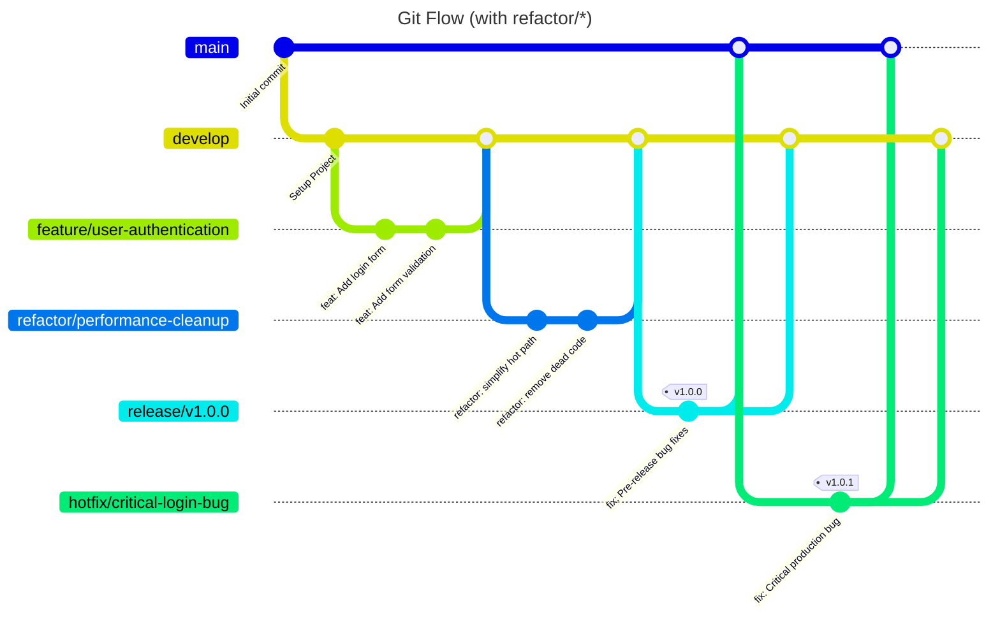

# **Development Workflow & Architecture Guide**

This document describes the development workflow, repository architecture, branching strategy and CI/CD for **AsyncFlow** 
---

## 1) Repository Layout

### 1.1 Project tree (backend)

```
AsyncFlow-backend/
├─ examples/                      # runnable examples (YAML & Python)
│  └─ data/
├─ scripts/                       # helper bash scripts (lint, quality, etc.)
│  └─ quality-check.sh
├─ docs/                          # product & technical docs
├─ tests/                         # unit & integration tests
│  ├─ unit/
│  └─ integration/
├─ src/
│  └─ asyncflow/                  # Python package (library)
│     ├─ __init__.py             # public "high-level" facade (re-exports)
│     ├─ builder/
│     │  └─ asyncflow_builder.py # internal builder implementation
│     ├─ components/             # PUBLIC FACADE: leaf Pydantic components
│     │  └─ __init__.py          # (barrel: re-exports Client, Server, Endpoint, Edge)
│     ├─ config/
│     │  ├─ constants.py         # enums/constants (source of truth)
│     │  └─ plot_constants.py
│     ├─ enums/                  # PUBLIC FACADE: selected enums
│     │  └─ __init__.py          # (barrel: re-exports Distribution, SampledMetricName, …)
│     ├─ metrics/
│     │  ├─ analyzer.py          # results post-processing
│     │  ├─ collector.py         # sampling collectors
│     │  ├─ client.py
│     │  ├─ edge.py
│     │  └─ server.py
│     ├─ resources/
│     │  ├─ registry.py
│     │  └─ server_containers.py
│     ├─ runtime/
│     │  ├─ simulation_runner.py # engine entry-point
│     │  ├─ rqs_state.py
│     │  ├─ actors/              # INTERNAL: Client/Server/Edge/Generator actors
│     │  └─ routing/
│     │     └─ lb_algorithms.py
│     ├─ samplers/
│     │  ├─ poisson_poisson.py
│     │  ├─ gaussian_poisson.py
│     │  └─ common_helpers.py
│     ├─ schemas/                # INTERNAL: full Pydantic schema impls
│     │  ├─ payload.py
│     │  ├─ common/
│     │  │  └─ random_variables.py
│     │  ├─ settings/
│     │  │  └─ simulation.py
│     │  ├─ topology/
│     │  │  ├─ edges.py
│     │  │  ├─ endpoint.py
│     │  │  ├─ graph.py
│     │  │  └─ nodes.py
│     │  └─ workload/
│     │     └─ rqs_generator.py
│     ├─ settings/               # PUBLIC FACADE: SimulationSettings
│     │  └─ __init__.py
│     └─ workload/               # PUBLIC FACADE: RqsGenerator
│        └─ __init__.py
├─ poetry.lock
├─ pyproject.toml
└─ README.md
```

**Public API surface (what you guarantee as stable):**

* High-level:

  ```py
  from asyncflow import AsyncFlow, SimulationRunner
  ```
* Components:

  ```py
  from asyncflow.components import Client, Server, Endpoint, Edge
  ```
* Workload & Settings:

  ```py
  from asyncflow.workload import RqsGenerator
  from asyncflow.settings import SimulationSettings
  ```
* Enums:

  ```py
  from asyncflow.enums import Distribution, SampledMetricName, EventMetricName, LbAlgorithmsName
  ```

> Everything under `asyncflow.schemas/`, `asyncflow.runtime/actors/`, `asyncflow.builder/` is **internal** (implementation details). The facades re-export only what users should import.

### 1.2 What each top-level area does

| Area            | Purpose                                                                                                                              |
| --------------- | ------------------------------------------------------------------------------------------------------------------------------------ |
| **builder/**    | Internal implementation of the pybuilder used by `AsyncFlow`. Users shouldn’t import from here directly.                             |
| **components/** | **Public facade** for *leaf* Pydantic models used in payloads: `Client`, `Server`, `Endpoint`, `Edge`.                               |
| **config/**     | Constants & enums source-of-truth (kept internal; only *selected* enums are re-exported via `asyncflow.enums`).                      |
| **enums/**      | **Public facade** re-exporting the enums that appear in public payloads (`Distribution`, `SampledMetricName`, `EventMetricName`, …). |
| **metrics/**    | Post-processing & visualization support (analyzer & collectors).                                                                     |
| **resources/**  | Runtime SimPy resource wiring (CPU/RAM containers, registries).                                                                      |
| **runtime/**    | The simulation engine entry-point (`SimulationRunner`), request lifecycle, and internal actors.                                      |
| **samplers/**   | Random-variable samplers for the generator and steps.                                                                                |
| **schemas/**    | Full Pydantic schema implementation and validation rules (internal).                                                                 |
| **settings/**   | **Public facade** re-exporting `SimulationSettings`.                                                                                 |
| **workload/**   | **Public facade** re-exporting `RqsGenerator`.                                                                                       |

---

## 2) Branching Strategy: Git Flow (+ `refactor/*`)

We use **Git Flow** with an extra branch family for clean refactors.

### Diagram



### Branch families

* **main** – production-ready, tagged releases only (no direct commits).
* **develop** – integration branch; base for `feature/*` and `refactor/*`.
* **feature/**\* – user-visible features (new endpoints/behavior, DB changes).
* **refactor/**\* – **no new features**; internal changes, performance, renames, file moves, debt trimming. Use `refactor:` commit prefix.
* **release/**\* – freeze, harden, docs; merge into `main` (tag) and back into `develop`.
* **hotfix/**\* – urgent production fixes; branch off `main` tag; merge into `main` (tag) and `develop`.

**When to pick which:**

* New behavior or external contract → `feature/*`
* Internal cleanup only → `refactor/*`
* Ship a version → `release/*`
* Patch production now → `hotfix/*`

---

## 3) CI/CD Pipeline

A layered pipeline (GitHub Actions recommended) mirrors the branching model.

### 3.1 CI on PRs to `develop` (feature/refactor)

**Quick Suite** (fast, no external services):

* **Ruff** (or Black/isort/Flake8) → style/lint
* **mypy** → type checking
* **pytest** unit-only: `pytest -m "not integration"`

### 3.2 CI on push to `develop`

**Full Suite** (slower; with services):

* Full tests, including `@pytest.mark.integration`
* Spin up **PostgreSQL**/**Redis** if required by integration tests
* Build multi-stage Docker image & smoke test
* Optionally build docs (mkdocs) to catch docstring regressions

### 3.3 CI on `release/*`

* Always run **Full Suite**
* Build and publish versioned images/artifacts
* Generate release notes/changelog

### 3.4 CI on `hotfix/*`

* Run **Full Suite**
* Tag patch release on merge to `main`
* Merge back to `develop`

> Refactors should be **behavior-preserving**. If a refactor touches hot paths, add micro-benchmarks or targeted integration tests and consider running the Full Suite pre-merge.

---

## 4) Quality Gates & Conventions

* **Style & Lint**: Ruff (or Black + isort + Flake8). No violations.
* **Types**: mypy clean.
* **Tests**:

  * Unit tests for new/refactored code paths
  * Integration tests for end-to-end behavior
* **Commits**: Conventional commits (`feat:`, `fix:`, `refactor:`, `docs:`, `test:`, `chore:`).
* **PRs**: Review required; refactors must include rationale and scope.
* **Docs**: Update `docs/` and public API references when you touch public facades.

---

## 5) Public API & Stability Contract

Only **facade modules** are considered public and stable:

* High-level:

  ```py
  from asyncflow import AsyncFlow, SimulationRunner
  ```
* Components:

  ```py
  from asyncflow.components import Client, Server, Endpoint, Edge
  ```
* Workload & Settings:

  ```py
  from asyncflow.workload import RqsGenerator
  from asyncflow.settings import SimulationSettings
  ```
* Enums:

  ```py
  from asyncflow.enums import Distribution, SampledMetricName, EventMetricName, LbAlgorithmsName
  ```

Everything else—`schemas/`, `runtime/actors/`, `builder/`, `samplers/`, `resources/`—is **internal** and can change without notice. Use **SemVer** for releases; any change to the public facades that breaks compatibility requires a **major** bump.

---

## 6) Developer Commands (Poetry)

* Install: `poetry install`
* Lint/format: `bash scripts/quality-check.sh` (or your Ruff/Black commands)
* Test (unit only): `pytest -m "not integration"`
* Test (full): `pytest`
* Run example: `python examples/single_server_pybuilder.py`

---

