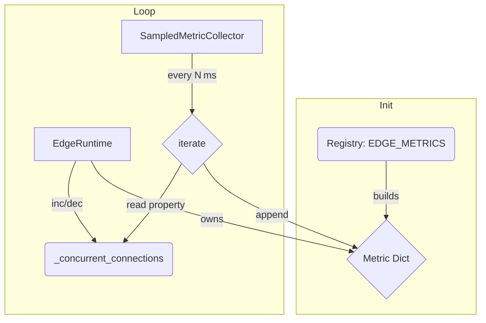

## Time‑Series Metrics: Architectural Overview

Collecting high‑frequency, time‑series metrics from a complex simulation requires an architecture that is **performant, maintainable, and extensible**. Our design meets those goals by keeping metric *declaration*, *state management,* and *data collection* in strictly separate layers.

\### 1  Guiding Principles & Architecture

1. **Minimal Hot‑Path Overhead** — every state update in the simulation core is `O(1)`.
2. **Single Source of Truth** — one “Registry” enumerates every metric that can exist.
3. **User‑Defined Extensibility** — advanced users can register custom metrics without touching the framework.
4. **Predictable Memory Footprint** — data structures are pre‑allocated once, never rebuilt at each sample tick.

| Layer         | Responsibility                                                   | Lifetime               |
| ------------- | ---------------------------------------------------------------- | ---------------------- |
| **Registry**  | Declare *which* metrics exist for each component type            | Module import (once)   |
| **Runtime**   | Maintain the **current value** of each metric per component      | Per component instance |
| **Collector** | Periodically read runtime values and append to time‑series lists | One per simulation run |

---

\### 2  Case Study — Edge Metric Collection



#### Layer Walk‑through

1. **Registry (`metrics/edge.py`)**

   ```python
   EDGE_METRICS = (SampledMetricName.EDGE_CONCURRENT_CONNECTION,)

   def build_edge_metrics(enabled):
       return {m: [] for m in EDGE_METRICS if m in enabled}
   ```

2. **Runtime (`EdgeRuntime`)**

   * Updates the counter `_concurrent_connections` in `O(1)`.
   * Holds the dict produced by `build_edge_metrics`.
   * **New:** exposes read‑only properties so external modules never touch private fields directly.

   ```python
   class EdgeRuntime:
       @property
       def concurrent_connections(self) -> int:
           return self._concurrent_connections

       @property
       def enabled_metrics(self) -> dict[SampledMetricName, list[float | int]]:
           return self._edge_enabled_metrics
   ```

3. **Collector (`SampledMetricCollector`)**

   ```python
   while True:
       yield env.timeout(sample_period_s)
       for edge in self.edges:
           key = SampledMetricName.EDGE_CONCURRENT_CONNECTION
           # properties keep encapsulation intact
           if key in edge.enabled_metrics:
               edge.enabled_metrics[key].append(edge.concurrent_connections)
   ```

---

\### 3  Why the `if key in …` Guard Still Matters

Even with the new properties, the guard remains essential:

* **Robustness** — prevents `KeyError` when a metric is disabled for a given edge.
* **Extensibility** — a user can add `EDGE_PACKET_LOSS` (or any custom metric) to a subset of edges; the collector automatically respects that configuration.

This single `O(1)` check keeps the system plug‑and‑play while preserving full encapsulation:

* Runtime internals stay protected behind properties.
* The collector never needs to know which metrics exist ahead of time.

---

