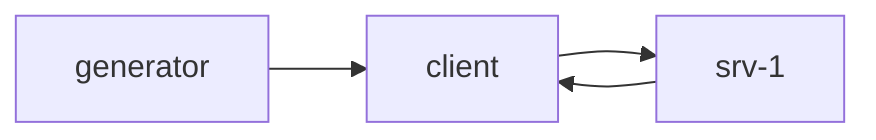

# Why AsyncFlow

> **TL;DR**: AsyncFlow is a *digital twin* of your FastAPI/Uvicorn service. It simulates traffic, async steps, and resource limits in seconds—so you can size CPU/pools/replicas and hit your latency SLOs **before** touching the cloud.

## What it is

* **Event-loop faithful**: Replays FastAPI-style async behavior in SimPy (parsing, CPU-bound work, I/O waits, LLM calls).
* **Resource-aware**: Models CPU cores (tokens), RAM, DB pools, and routing so you see queueing, contention, and scheduling delays.
* **Prod-style metrics**: Emits p50/p95/p99 latency, throughput, ready-queue lag, concurrency per edge/server—even estimated LLM cost.

## What you get

* **Numbers you can plan with**: p95, max concurrency, queue lengths, RAM usage, RPS over time.
* **Rapid “what-if” loops**: Double traffic, change cores/pools, add a replica—see the impact immediately.
* **Cheap, offline iteration**: Results in seconds, no clusters, no load-test bills.

## 10-second example

**Minimal scenario (YAML)**

```yaml
# examples/data/minimal.yml
rqs_input:
  id: rqs-1
  avg_active_users: { mean: 50 }                    # Poisson by default
  avg_request_per_minute_per_user: { mean: 20 }     # must be Poisson
  user_sampling_window: 60

topology_graph:
  nodes:
    client: { id: client-1 }
    servers:
      - id: srv-1
        server_resources: { cpu_cores: 2, ram_mb: 2048 }
        endpoints:
          - endpoint_name: /predict
            steps:
              - kind: initial_parsing
                step_operation: { cpu_time: 0.002 }
              - kind: io_wait
                step_operation: { io_waiting_time: 0.010 }
  edges:
    - { id: gen-client,   source: rqs-1,   target: client-1,
        latency: { mean: 0.003, distribution: exponential } }
    - { id: client-srv,   source: client-1, target: srv-1,
        latency: { mean: 0.003, distribution: exponential } }
    - { id: srv-client,   source: srv-1,   target: client-1,
        latency: { mean: 0.003, distribution: exponential } }

sim_settings:
  total_simulation_time: 300
  sample_period_s: 0.01
  enabled_sample_metrics: [ ready_queue_len, ram_in_use, edge_concurrent_connection ]
  enabled_event_metrics: [ rqs_clock ]
```

**Run it (Python)**

```python
from pathlib import Path
import simpy
from asyncflow.runtime.simulation_runner import SimulationRunner

env = simpy.Environment()
runner = SimulationRunner.from_yaml(env=env, yaml_path=Path("examples/data/minimal.yml"))
results = runner.run()

print(results.get_latency_stats())        # p50/p95/p99, etc.
print(results.get_throughput_series())    # (timestamps, rps)
```

## The mental model



* Each arrow is a **network edge** with its own latency RV.
* Server endpoints are **linear step chains**: CPU → RAM → I/O, etc.
* CPU/DB/RAM are **capacity-limited resources** → queues form under load.

## Non-goals (by design)

* Not a replacement for **production** load tests or packet-level network simulators.
* Not a micro-profiler; it models service times and queues, not byte-level protocol details.
* Not an auto-tuner—**you** iterate quickly with data to choose the best configuration.

---

**Bottom line:** AsyncFlow turns your architecture diagram into hard numbers—p95, concurrency, queue lengths—so you can plan capacity, de-risk launches, and explain trade-offs with evidence, not guesswork.
