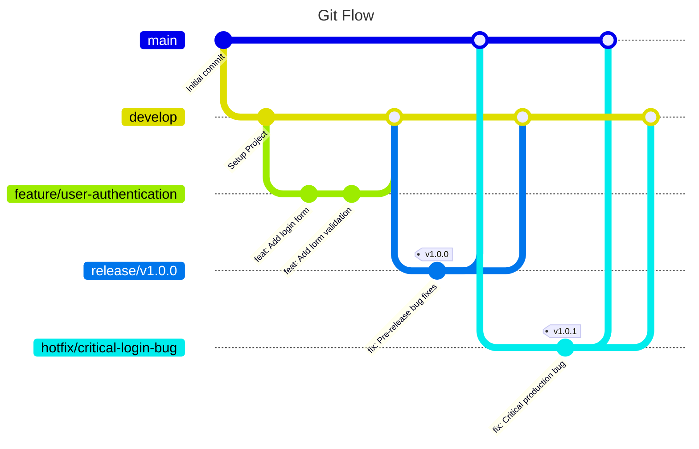

# **Development Workflow & Architecture Guide**

This document outlines the standardized development workflow, repository architecture, and branching strategy for the backend of the FastSim project. Adhering to these guidelines ensures consistency, maintainability, and a scalable development process.

## 1. Technology Stack

The project is built upon the following core technologies:

-   **Backend**: FastAPI
-   **Backend Package Manager**: Poetry
-   **Frontend**: React + JavaScript
-   **Database**: PostgreSQL
-   **Caching**: Redis
-   **Containerization**: Docker

### 2.1. Backend Service (`FastSim-backend`)

This repository contains all code related to the FastAPI backend service. Its primary responsibility is to handle business logic, interact with the database, and expose a RESTful API.

**Folder Structure:**
```
project-backend/
├── .github/                            # CI workflows: tests, builds, and publishes the Docker image
│   └── workflows/
│       └── main.yml
├── src/
│   └── app/                           # Main Python package
│       ├── api/                       # API routers & endpoints
│       ├── db/                        # Database session management & base models
│       ├── models/                    # SQLAlchemy ORM models (database table definitions)
│       ├── schemas/                   # Pydantic schemas for validation/serialization
│       ├── core/                      # Business logic (services, utilities, etc.)
│       ├── config/                    # settings.py & constants.py for configuration
│       └── main.py                    # FastAPI application entrypoint
├── Alembic/                           # Database migrations managed with Alembic
│   ├── versions/                      # Generated migration files
│   ├── env.py                         # Alembic environment setup
│   └── script.py.mako                 # Template for new migrations
├── tests/                             # Unit and integration tests
├── alembic.ini                        # Alembic configuration file
├── py.ini                             # Python tool configurations (flake8, mypy, etc.)
├── .env.example                       # Template for environment variables
├── .gitignore                         # Files and paths ignored by Git
├── docker-compose.override.yml        # Local overrides (e.g., hot-reload)
├── docker-compose.test.yml            # Docker Compose setup for isolated testing
├── docker-compose.yml                 # Base Docker Compose configuration for development
├── Dockerfile                         # Instructions to build the production Docker image
├── poetry.lock                        # Locked dependency versions for Poetry
├── pyproject.toml                     # Poetry project configuration (including src layout)
└── README.md                          # Setup instructions and project overview

```

**Key Responsibilities:**
*   To be testable in isolation.
*   To produce a versioned Docker image (`backend:<tag>`) as its main artifact.

## 3. Branching Strategy: Git Flow

To manage code development and releases in a structured manner, we use the **Git Flow** branching model.

### Git Flow Workflow Diagram



---

### Git Flow Explained

This workflow is built upon two long-lived branches and several temporary, supporting branches.

#### Main Branches

1.  **`main`**
    *   **Purpose**: This branch contains **production-ready, stable code**. Every commit on `main` represents a new, official release.
    *   **Rules**: You should **never** commit directly to `main`. It only receives merges from `release/*` and `hotfix/*` branches. Each merge should be tagged with a version number (e.g., `v1.0.0`).

2.  **`develop`**
    *   **Purpose**: This is the main **integration branch** for ongoing development. It contains all completed and tested features that are planned for the next release.
    *   **Rules**: It's the base for creating new `feature/*` branches. It reflects the most up-to-date state of development.

#### Supporting Branches

3.  **`feature/*`** (e.g., `feature/user-authentication`)
    *   **Purpose**: To develop a new, specific feature in isolation.
    *   **Lifecycle**:
        1.  Branched off of **`develop`**.
        2.  Once development is complete, a **Pull Request (PR)** is opened to merge the changes back into **`develop`**.
        3.  After the merge, the `feature/*` branch can be deleted.

4.  **`release/*`** (e.g., `release/v1.2.0`)
    *   **Purpose**: To prepare for a new production release. This branch is used for final bug fixes, documentation updates, and last-minute testing. It freezes the feature set for the release.
    *   **Lifecycle**:
        1.  Branched off of **`develop`** when it's decided that the next version is feature-complete.
        2.  When ready, it is merged into **`main`** (and tagged) and also back into **`develop`** to ensure any fixes made during the release phase are not lost.
        3.  After merging, the `release/*` branch can be deleted.

5.  **`hotfix/*`** (e.g., `hotfix/critical-login-bug`)
    *   **Purpose**: To quickly patch a critical bug discovered in the production version (`main`).
    *   **Lifecycle**:
        1.  Branched off of **`main`** (from the specific version tag).
        2.  Once the fix is ready, it is merged into **`main`** (and a new patch version tag is created, e.g., `v1.0.1`).
        3.  It is also merged into **`develop`** to ensure the fix is included in future releases.
        4.  After merging, the `hotfix/*` branch can be deleted.

## 4. Continuous Integration / Continuous Delivery (CI/CD) Pipeline

A robust CI/CD pipeline guarantees that every change pushed to the repository is automatically validated, packaged, and—when appropriate—promoted to the next environment.
Our pipeline is built with **GitHub Actions** and follows a layered approach that mirrors the Git Flow branching model.

We will start to describe the CI part related to push and PR in the develop branch of the backend service.

### 4.1  CI for project-backend on `develop`

#### 4.1.1  Goals

* **Fast feedback** – linting, type-checking, and unit tests finish in under a minute for every Pull Request.
* **Confidence in integration** – migrations, integration tests, and Docker smoke-tests run on every push to `develop`.
* **Deployment safety** – only artifacts produced from a green pipeline can be released or deployed.
* **Parity with production** – the same multi-stage Dockerfile is built and probed in CI, preventing “works-on-my-machine” surprises.

### 4.1.2  Pipeline Layers

* **Quick Suite (PR to `develop`)**
  *Runs in seconds; no external services or containers.*

  * Black, isort, Flake8
  * mypy static type-checking
  * Unit tests only (`pytest -m "not integration"`)

* **Full Suite (push to `develop`)**
  *Runs in a few minutes; includes real services and Docker.*

  * All steps from the Quick Suite
  * PostgreSQL service container started via `services:`
  * Alembic migrations applied to the test database
  * Full test suite, including `@pytest.mark.integration` tests
  * Multi-stage Docker build of the backend image
  * Smoke test: container started with Uvicorn → `curl /health`


### 4.1.3  Key Implementation Details

* **Service containers** – PostgreSQL 17 is spun up in CI with a health-check to ensure migrations run against a live instance.
* **Test markers** – integration tests are isolated with `@pytest.mark.integration`, enabling selective execution.
* **Caching** – Poetry’s download cache is restored to cut installation time; Docker layer cache is reused between builds.
* **Smoke test logic** – after the image is built, CI launches it in detached mode, polls the `/health` endpoint, prints logs, and stops the container. The job fails if the endpoint is unreachable.
* **Secrets management** – database credentials and registry tokens are stored in GitHub Secrets and injected as environment variables only at runtime.


